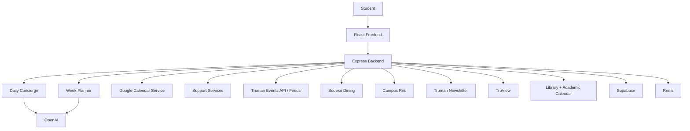
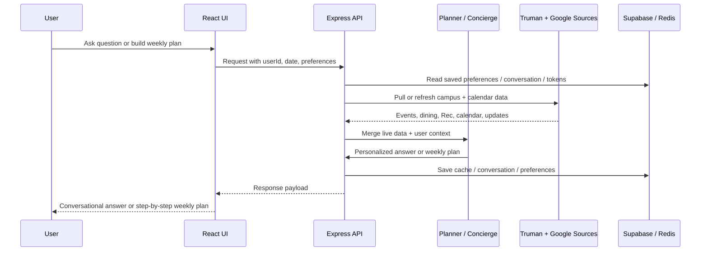

# TruCompass

TruCompass is an AI-powered student voice assistant built for Truman State University. It turns fragmented campus systems into one personalized assistant that helps students understand what is happening on campus, plan their week around their real schedule, and act on recommendations without jumping between multiple websites.

This project was built for a hackathon theme focused on **AI-driven solutions for university-level problems**.

## Problem

University students constantly switch between:

- event calendars
- athletics schedules
- dining menus
- Campus Rec information
- newsletter posts
- support resources
- personal calendars

Even when all of that information exists, it is scattered across separate systems, updates at different times, and rarely answers the real question a student has:

**"What matters to me right now, and what should I do next?"**

## Solution

TruCompass combines live Truman data, Google Calendar context, and AI orchestration into a single mobile-first experience with two core flows:

- **Daily Concierge**: a conversational assistant for questions like "What is going on today?", "Is the Rec open right now?", or "What fits in my schedule?"
- **Plan My Week**: a guided planning journey that builds a personalized week around classes, meetings, meals, study time, Rec preferences, and campus events

Instead of only retrieving information, TruCompass also helps students act on it by drafting or creating Google Calendar events and weekly plans.

## Key Features

### 1. Daily Concierge

- Conversational campus Q&A
- Time-aware responses for "today", "right now", and "tomorrow"
- Calendar-aware suggestions based on real free/busy blocks
- Support for streaming responses and spoken replies
- Calendar meeting/reminder drafting when the user explicitly asks to schedule something

### 2. Plan My Week

- Guided, step-by-step planning flow
- Personalization using:
  - Google Calendar
  - dining preferences
  - event preferences
  - Rec preferences
  - study preferences
  - hardest courses
- Course inference from calendar events
- Specific study blocks placed around real schedule constraints
- Rec suggestions based on user preferences and live/saved Rec crowd patterns
- One-click individual calendar saves or full-plan batch save

### 3. Live Campus Data Integration

TruCompass pulls from multiple Truman-facing sources:

- Truman on-campus events
- Truman athletics events
- Truman feeds and updates
- Truman newsletter
- Campus Rec hours, classes, live count, and saved crowd history
- Sodexo dining menus and dining hall hours
- TruView public metadata and feature discovery
- Pickler Library hours
- Truman academic calendar

### 4. Cloud-Ready State Management

The app supports:

- **Supabase** for persistent user/application state
- **Upstash Redis** for cache and fast campus data reuse
- **Render** deployment readiness

## Why This Is AI-Driven

TruCompass is not just a search layer over campus websites. It uses AI for:

- routing user intent between campus info, scheduling, and planning flows
- turning multiple live sources into a concise student-facing response
- generating personalized weekly plan summaries
- producing calendar-ready meeting drafts
- adapting outputs to schedule context instead of showing raw lists

## System Architecture


## Data Flow



## How the Data Is Collected

TruCompass intentionally uses a mix of official APIs, structured public data, and lightweight scraping where public APIs are not available.

### Truman events and feeds

- Uses the Truman API client and feed endpoints for on-campus events, athletics event streams, and feed updates
- Normalizes event times, categories, and display fields into a shared format

### Athletics

- Uses Truman athletics event data and homepage parsing/fallback logic to surface local Truman sports activity in a student-friendly way

### Dining

- Uses Sodexo location pages plus Sodexo menu endpoints for date-specific meal data
- Parses hall hours and menu sections into breakfast/lunch/dinner suggestions
- Filters out non-food placeholders such as "Have a nice day"

### Campus Rec

- Pulls live occupancy and class/event information
- Stores Rec snapshots over time so future planning can use crowd-aware suggestions
- Uses schedule-aware filtering to avoid recommending Rec items that overlap busy calendar time

### Newsletter

- Scrapes the Truman newsletter issue page and extracts article headlines/links
- Uses lightweight ranking for relevant newsletter answers

### TruView

- Reads public portal metadata and unauthenticated feature availability
- Used to extend resource and university knowledge coverage

### Google Calendar

- OAuth-based connection flow
- Reads real user schedule data
- Calculates free blocks from busy events
- Creates individual or batch calendar events without overlapping existing events

## Tech Stack

- **Frontend**: React, Vite, custom CSS
- **Backend**: Node.js, Express
- **AI Layer**: OpenAI text + speech orchestration
- **Persistence**: Supabase
- **Caching**: Upstash Redis
- **Auth / Actions**: Google OAuth 2.0 + Google Calendar API
- **Parsing / Scraping**: Cheerio, HTML parsing, feed parsing
- **Deployment**: Render

## Repository Structure

```text
client/                  React frontend
src/
  config/                Environment config
  integrations/          External clients (Google, Truman, OpenAI, Supabase, Redis)
  routes/                API route layer
  services/              Domain logic (concierge, planner, dining, rec, events, etc.)
  lib/                   Shared caching, stores, time, and utility helpers
supabase/                SQL schema for persistent app tables
render.yaml              Render Blueprint configuration
```

## Local Development

### 1. Install dependencies

```bash
npm install
```

### 2. Create your `.env`

Start from `.env.example` and provide the required values.

### 3. Run the app

```bash
npm run dev:all
```

Frontend:

- `http://localhost:5173`

Backend:

- `http://localhost:3000`

### 4. Health check

```bash
http://localhost:3000/health
```

## Environment Variables

At minimum, production expects:

```env
GOOGLE_CLIENT_ID=
GOOGLE_CLIENT_SECRET=
GOOGLE_REDIRECT_URI=

OPENAI_API_KEY=

SUPABASE_URL=
SUPABASE_SERVICE_ROLE_KEY=
UPSTASH_REDIS_REST_URL=
UPSTASH_REDIS_REST_TOKEN=
REDIS_KEY_PREFIX=trucompass
REDIS_CACHE_TTL_SECONDS=604800
```

Notes:

- `SUPABASE_SERVICE_ROLE_KEY` must remain backend-only
- local development can use `http://localhost:3000/api/calendar/google/callback`
- deployed environments should use the Render callback URL

## Deployment

This repo includes `render.yaml` for Render Blueprint deployment.

Build command:

```bash
npm install && npm run build:client
```

Start command:

```bash
npm run start
```

After deployment:

1. set Render environment variables
2. add the Render Google OAuth callback URL in Google Cloud Console
3. open `/health`
4. confirm:
   - `googleCalendarConfigured`
   - `openAiConfigured`
   - `supabaseConfigured`
   - `redisConfigured`

